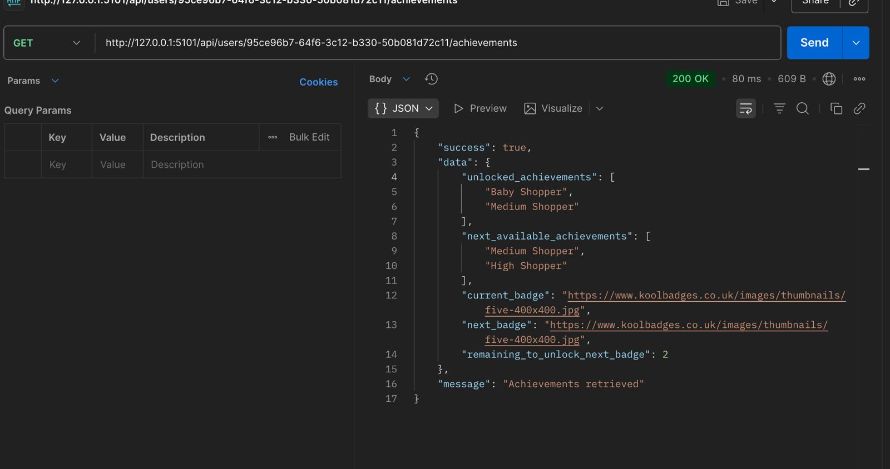

## Loyalty Program

This repo contains the frontend and backend project.

## Backend Installation
Clone the repository and install dependencies:

```bash
cd backend

# Install PHP dependencies
cd backend && composer install
```

Sample response from postman, i am using uuid instead of id to get a user to avoid knowing the number of data in the users table


## Environment Configuration

Copy the example environment file and set up the required configurations:

```bash
cd backend && cp .env.example .env
```

Generate the application key:

```bash
cd backend && php artisan key:generate
```

Run migration:
```bash
cd backend && php artisan migrate
```

Seed some users and the achievement:
```bash
cd backend && php artisan db:seed
```

## Running the Application

Start the development server:

```bash
cd backend && php artisan serve
```

shows up on http://127.0.0.1:8000

Test purchase trigger for default user:

```bash
cd backend && php artisan app:trigger-purchase-event
```


Visit the url.

```bash
cd backend && ./vendor/bin/sail up
```
## Deployment

### Deploying to Production

For production deployment, set up your web server:

```bash
cd backend && php artisan config:cache
cd backend && php artisan route:cache
cd backend && php artisan view:cache
```

For the frontend 
Use npm or yarn
```bash
npm install
```

Use npm or yarn
```bash
yarn install
```

Frontend get loaded here http://localhost:5173/
